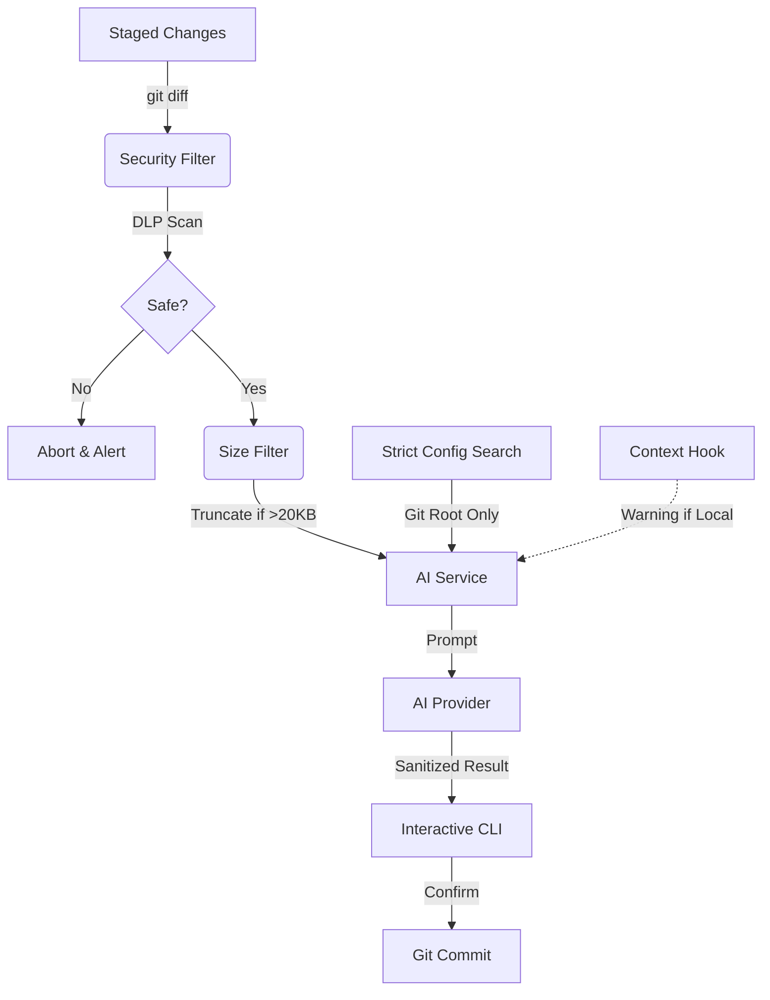

# self-commit

[](https://www.npmjs.com/package/self-commit)
[](https://opensource.org/licenses/MIT)
[](https://github.com/chachachavito/self-commit)

> The agnostic copywriting assistant for structured git commits.

```bash
# Get started immediately
npx self-commit
```

---

## Why?

Git commit messages are often inconsistent, vague, or forgotten. **self-commit** fixes that by analyzing your code changes and generating structured, meaningful commit messages that explain **why** a change exists, not just **what** changed.

---

## Features

- **AI-Assisted Copywriting:** Drafts intent-focused messages using GPT-4o-mini or Gemini 1.5.
- **Fully Agnostic:** Language-independent and supports multiple AI providers.
- **Security First:** Built-in secret scanning (DLP) and sensitive file filtering.
- **Global Credential Store:** Securely save your API keys; use them across all projects.
- **Conventional Commits:** Strictly follows the standard and integrates with `commitlint`.
- **Extensible Context:** Opt-in architectural analysis to enrich the AI's understanding (via `--context`).

---

## Architecture



---

## Installation

```bash
npm install -D self-commit
```

## Setup

Set your API key once globally (using a secure prompt to protect your shell history):

```bash
# For OpenAI
npx self-commit set-key openai

# For Gemini
npx self-commit set-key gemini
```

### Management

```bash
# Check configuration status
npx self-commit status

# Remove a global key
npx self-commit delete-key openai
```

---

## Usage

```bash
git add .
npx self-commit

# To include architectural context (expensive in tokens)
npx self-commit --context
```

### Options

| Flag            | Description                            | Default |
| --------------- | -------------------------------------- | ------- |
| `-d, --dry-run` | Preview the message without committing | `false` |
| `-c, --context` | Enable architectural context analysis  | `false` |
| `-v, --version` | Show current version                   | -       |
| `-h, --help`    | Show help                              | -       |

### Configuration (`self-commit.config.json`)

```json
{
  "provider": "openai",
  "model": "gpt-4o-mini",
  "language": "en",
  "verbosity": "normal",
  "contextCommand": "architecture-generate ."
}
```

---

## Security

**self-commit** is built with professional-grade security to protect your code and credentials:

- **Secret Masking**: The `set-key` command uses secure interactive prompts to prevent API keys from being stored in your shell history.
- **DLP (Data Loss Prevention)**: Automatically scans staged diffs for secrets (API keys, PEM files, etc.) and filters sensitive files like `.env`.
- **Execution Safety**:
  - **Context Warning**: Triggers a warning when executing `contextCommand` from project-level configurations.
  - **Injection Immunity**: Uses `spawn` with `shell: false` and argument separators (`--`) to prevent shell injection via malicious filenames.
- **Resilience**:
  - **DoS & Cost Protection**:
  - **Diff Limit**: Truncates diffs larger than 20KB to prevent API cost exhaustion and token overflows.
  - **Opt-in Context**: Architectural analysis (`contextCommand`) is disabled by default to save tokens; must be explicitly enabled via `--context`.
  - **Config Hijacking Protection**: Restricts configuration search to the current Git repository root.
  - **Output Sanitization**: Strips control characters and markdown artifacts from AI responses.
- **Data Privacy**: No middleman servers. Communication happens directly between your machine and the AI provider.

> [!IMPORTANT]
> Always audit your changes for hardcoded secrets before staging.

---

## Manifesto

Writing commit messages is part of thinking. Most commits today are rushed, inconsistent, and disconnected from real intent.

**self-commit** treats commits as structured expressions of intent. By transforming code changes into organized data, we ensure a readable and professional project history. This serves as the essential foundation for future project intelligence and evolutionary analysis (the **self-graph** ecosystem).

---

## Development

```bash
git clone https://github.com/chachachavito/self-commit.git
cd self-commit
npm install
npm run build
npm test
```

---

## License

MIT
