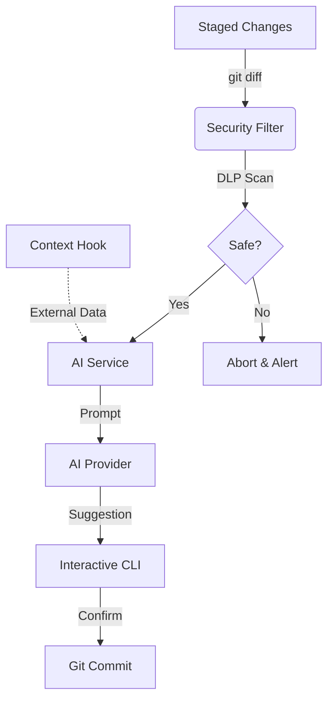

# self-commit

[](https://www.npmjs.com/package/self-commit)
[](https://opensource.org/licenses/MIT)
[](https://github.com/bruchave/self-commit)

> The agnostic copywriting assistant for structured git commits.

```bash
# Get started immediately
npx self-commit
```

---

## Why?

Git commit messages are often inconsistent, vague, or forgotten. **self-commit** fixes that by analyzing your code changes and generating structured, meaningful commit messages that explain **why** a change exists, not just **what** changed.

---

## Features

- **AI-Assisted Copywriting:** Drafts intent-focused messages using GPT-4o-mini or Gemini 1.5.
- **Fully Agnostic:** Language-independent and supports multiple AI providers.
- **Security First:** Built-in secret scanning (DLP) and sensitive file filtering.
- **Global Credential Store:** Securely save your API keys once; use them across all projects.
- **Conventional Commits:** Strictly follows the standard and integrates with `commitlint`.
- **Extensible Context:** Run architectural analysis commands to enrich the AI's understanding.

---

## Architecture



---

## Installation

```bash
npm install -D self-commit
```

## Setup

Set your API key once globally:

```bash
# For OpenAI
npx self-commit set-key openai sk-...

# For Gemini
npx self-commit set-key gemini AIza...
```

### Management

```bash
# Check configuration status
npx self-commit status

# Remove a global key
npx self-commit delete-key openai
```

---

## Usage

```bash
git add .
npx self-commit
```

### Configuration (`self-commit.config.json`)

```json
{
  "provider": "openai",
  "model": "gpt-4o-mini",
  "language": "en",
  "verbosity": "normal",
  "contextCommand": "architecture-generate ."
}
```

---

## Security

**self-commit** is built for professional environments:

- **Sensitive File Filtering:** Automatically excludes `.env`, `*.pem`, `*.key`, `package-lock.json`, etc.
- **Secret Scanning (DLP):** Scans the content of the diff for potential secrets (API keys, AWS tokens, GitHub tokens) and aborts the analysis if detected.
- **Injection Immunity:** Uses `spawn` (with `shell: false`) to execute external commands. This design neutrally handles arguments, making command injection impossible by bypassing the shell interpreter.
- **Local Credential Storage:** Your API keys are stored **locally and only on your machine** using the standard system data directory.
- **Config Transparency:** Automatically warns you if a local configuration file (from the current project) is being used, preventing "config poisoning" attacks.
- **AI Output Hardening:** Enforces strict response size limits (max tokens) on all AI providers to prevent Denial of Service (DoS) from malicious or hallucinated responses.
- **Direct Communication:** self-commit has no middleman servers. It communicates directly from your machine to the AI provider (OpenAI/Google).
- **Data Privacy:** Only the source code diff and file names are sent to the AI provider. No other metadata or personal data is shared.

> [!IMPORTANT]
> Always audit your changes for hardcoded secrets before staging.

---

## Manifesto

Writing commit messages is part of thinking. Most commits today are rushed, inconsistent, and disconnected from real intent.

**self-commit** treats commits as structured expressions of intent. By transforming code changes into organized data, we ensure a readable and professional project history. This serves as the essential foundation for future project intelligence and evolutionary analysis (the **self-graph** ecosystem).

---

## License

MIT
