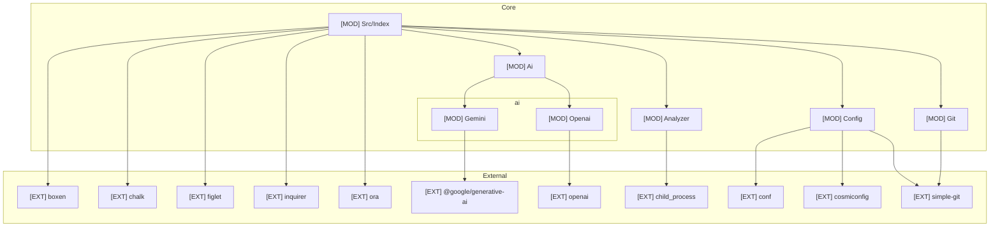

# Architecture Diagram

```mermaid
flowchart TD
  subgraph Core ["Core"]
      src_ai_js["[MOD] Ai"]
      src_analyzer_js["[MOD] Analyzer"]
      src_config_js["[MOD] Config"]
      src_git_js["[MOD] Git"]
      src_index_js["[MOD] Src/Index"]
    subgraph Core_ai ["ai"]
      src_ai_providers_gemini_js["[MOD] Gemini"]
      src_ai_providers_openai_js["[MOD] Openai"]
    end
  end
  subgraph External ["External"]
      _google_generative_ai["[EXT] @google/generative-ai"]
      boxen["[EXT] boxen"]
      chalk["[EXT] chalk"]
      child_process["[EXT] child_process"]
      conf["[EXT] conf"]
      cosmiconfig["[EXT] cosmiconfig"]
      figlet["[EXT] figlet"]
      inquirer["[EXT] inquirer"]
      openai["[EXT] openai"]
      ora["[EXT] ora"]
      simple_git["[EXT] simple-git"]
  end
  src_ai_js --> src_ai_providers_gemini_js
  src_ai_js --> src_ai_providers_openai_js
  src_ai_providers_gemini_js --> _google_generative_ai
  src_ai_providers_openai_js --> openai
  src_analyzer_js --> child_process
  src_config_js --> conf
  src_config_js --> cosmiconfig
  src_config_js --> simple_git
  src_git_js --> simple_git
  src_index_js --> boxen
  src_index_js --> chalk
  src_index_js --> figlet
  src_index_js --> inquirer
  src_index_js --> ora
  src_index_js --> src_ai_js
  src_index_js --> src_analyzer_js
  src_index_js --> src_config_js
  src_index_js --> src_git_js

```
